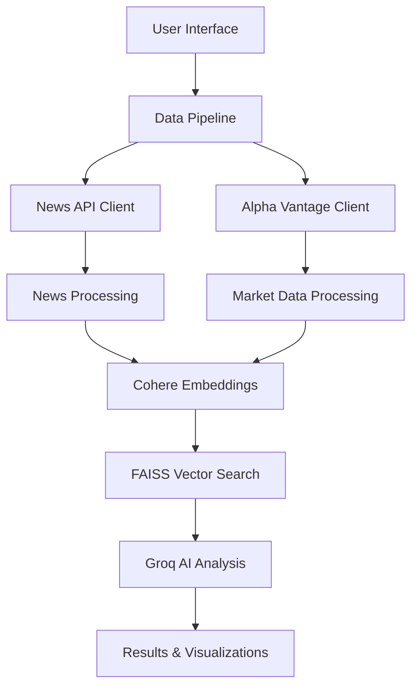

# 🚀 FinWise AI - Global Financial Intelligence Platform

[](https://finwiseai.streamlit.app/)
[](https://www.python.org/downloads/)
[](https://opensource.org/licenses/MIT)

> **Analyze any financial topic, anywhere, anytime with AI-powered insights**

FinWise AI is a comprehensive financial intelligence platform that combines real-time news analysis, market data processing, and AI-powered insights to provide deep financial intelligence on any topic or geographic region.

## 🌟 Features

### 📈 **Multi-Source Data Analysis**
- **Real-time News Analysis** using NewsAPI (1,000+ global sources)
- **Live Market Data** via Alpha Vantage (stocks, forex, crypto)
- **AI-Powered Insights** with Cohere embeddings and Groq inference
- **Global Coverage** across 40+ countries and regions

### 🤖 **Advanced AI Capabilities**
- **Semantic Search** using vector embeddings
- **Sentiment Analysis** for market trends
- **Interactive AI Assistant** for Q&A
- **Contextual Financial Advice** based on real data

### 📊 **Rich Visualizations**
- **Interactive Charts** with Plotly
- **Market Performance Tracking**
- **News Timeline Analysis**
- **Source Distribution Analytics**

### 🌍 **Global Market Intelligence**
- **Geographic Focus**: US, Europe, Asia, Emerging Markets
- **Sector Analysis**: Technology, Healthcare, Energy, Finance, etc.
- **Custom Time Ranges**: 7 days to 3+ months
- **Multi-language Support**: English, Spanish, French, German, etc.

## 🎯 Use Cases

- **Investment Research**: Analyze market trends and sentiment
- **Risk Assessment**: Monitor geographic and sector-specific risks  
- **News Monitoring**: Track breaking financial news globally
- **Market Analysis**: Compare performance across regions/sectors
- **Academic Research**: Study financial markets with real data
- **Business Intelligence**: Monitor industry developments

## 🚀 Quick Start

### 1. **Clone Repository**
```bash
git clone https://github.com/yourusername/finwise-ai.git
cd finwise-ai
```

### 2. **Install Dependencies**
```bash
pip install -r requirements.txt
```

### 3. **Get API Keys** (Free Tiers Available)
- [NewsAPI](https://newsapi.org) - 1,000 requests/day free
- [Alpha Vantage](https://alphavantage.co) - 500 calls/day free  
- [Cohere](https://cohere.ai) - 1,000 calls/month free
- [Groq](https://groq.com) - High-speed inference free tier

### 4. **Run Application**
```bash
streamlit run finwise-ai-complete.py
```

## 📱 Usage Examples

### **Technology Sector Analysis**
```
Topic: "artificial intelligence machine learning"
Region: United States
Stocks: NVDA, GOOGL, MSFT, AAPL
Timeframe: Last 30 days
```

### **European Energy Markets**
```
Topic: "renewable energy solar wind"
Region: Germany  
Stocks: ICLN, PBW, QCLN
Timeframe: Last 3 months
```

### **Global Healthcare Trends**
```
Topic: "biotechnology pharmaceutical innovation"
Region: Global
Stocks: JNJ, PFE, MRNA, GILD
Timeframe: Last 7 days
```

## 🏗️ Architecture



### **Core Components**

- **`EnhancedNewsAPIClient`**: Multi-country news fetching with filtering
- **`EnhancedAlphaVantageClient`**: Global market data with regional indices
- **`EnhancedFinancialDataProcessor`**: AI-powered data processing and search
- **`EnhancedFinancialAdvisor`**: Groq-powered analysis and chat interface
- **`EnhancedFinWiseDataPipeline`**: Orchestrates end-to-end analysis

## 📊 Supported Data Sources

### **News Sources (40+ Countries)**
- United States, United Kingdom, Canada, Australia
- Germany, France, Italy, Spain, Netherlands  
- Japan, South Korea, China, India, Singapore
- Brazil, Mexico, Argentina, South Africa
- And many more...

### **Market Data**
- **US Markets**: NYSE, NASDAQ, AMEX
- **European Markets**: LSE, DAX, CAC 40, FTSE MIB
- **Asian Markets**: TSE, HKEX, BSE, SGX
- **Global ETFs & Indices**: S&P 500, FTSE, Nikkei, etc.

### **Economic Indicators**
- GDP, CPI, Unemployment rates
- Interest rates, Treasury yields
- Currency exchange rates (forex)

## 🔒 API Rate Limits & Costs

| Service | Free Tier | Paid Plans | Usage in App |
|---------|-----------|------------|--------------|
| NewsAPI | 1,000 req/day | $449/month | 20-100 per analysis |
| Alpha Vantage | 500 req/day, 5/min | $49.99/month | 1-10 per analysis |
| Cohere | 1,000 calls/month | $1/1M tokens | 1-5 per analysis |
| Groq | Generous free tier | Pay-per-use | 1-3 per analysis |

> **💡 Tip**: Free tiers support 10-50 analyses per day depending on configuration.

## ⚡ Performance Optimization

### **Recommended Settings**
- **Max Articles**: 20-50 (vs 100 max)
- **Analysis Depth**: Standard (vs Deep)
- **Stock Symbols**: 3-7 symbols max
- **Date Range**: 30 days (sweet spot)

### **API Optimization**
- Batch requests when possible
- Cache results using export function  
- Monitor rate limits in provider dashboards
- Use off-peak hours for better performance

## 🛠️ Development

### **Project Structure**
```
finwise-ai/
├── finwise-ai-complete.py      # Main application
├── requirements.txt            # Python dependencies
├── README.md                   # This file
└──Manual.pdf                   # Detailed user guide
```

### **Key Classes**
- `EnhancedNewsAPIClient`: News data fetching and filtering
- `EnhancedAlphaVantageClient`: Market data retrieval  
- `EnhancedFinancialDataProcessor`: AI processing and embeddings
- `EnhancedFinancialAdvisor`: Analysis and chat functionality
- `EnhancedFinWiseDataPipeline`: Main orchestration

### **Adding New Features**
1. **New Data Sources**: Extend client classes
2. **Analysis Types**: Add methods to `FinancialAdvisor`
3. **Visualizations**: Extend the visualizations tab
4. **Export Formats**: Add to export options in sidebar

## 🧪 Testing

### **Run Locally**
```bash
streamlit run finwise-ai-complete.py
```

### **Test with Sample Data**
Use the built-in presets:
- Technology Trends - US
- Renewable Energy - Europe  
- Healthcare Innovation - Global
- Cryptocurrency - Asia
- Climate Change Impact

### **Validate API Keys**
The app will show specific error messages for invalid/missing keys.

## 🚀 Deployment

### **Streamlit Cloud** (Recommended)
1. Push code to GitHub
2. Connect repository to [Streamlit Cloud](https://streamlit.io/cloud)
3. Add API keys in Secrets section
4. Deploy with one click


## 🤝 Contributing

We welcome contributions! Here's how you can help:

### **Ways to Contribute**
- 🐛 **Bug Reports**: Open issues for bugs
- 💡 **Feature Requests**: Suggest new capabilities
- 📖 **Documentation**: Improve guides and examples
- 🔧 **Code**: Submit pull requests

### **Development Setup**
1. Fork the repository
2. Create feature branch: `git checkout -b feature-name`
3. Make changes and test locally
4. Submit pull request with clear description

### **Code Style**
- Follow PEP 8 Python style guide
- Add docstrings for new functions
- Include error handling for API calls
- Test with multiple data scenarios

## 📄 License

This project is licensed under the MIT License - see the [LICENSE](LICENSE) file for details.

## 🙏 Acknowledgments

- **Streamlit** - Amazing web app framework
- **NewsAPI** - Comprehensive news data
- **Alpha Vantage** - Reliable financial data
- **Cohere** - Powerful text embeddings
- **Groq** - Fast AI inference
- **Plotly** - Beautiful interactive charts

## 📞 Support

### **Getting Help**
- 📧 **Email**: princepatel09112004@gmail.com

### **Common Issues**
- **API Errors**: Check key validity and rate limits
- **No Data**: Verify topic spelling and date ranges  
- **Slow Performance**: Reduce data volume and use standard analysis
- **Memory Issues**: Clear browser cache and restart

**⭐ If you find FinWise AI useful, please star this repository!**

**Built with ❤️ by Prince Patel | © 2025 FinWise AI**
